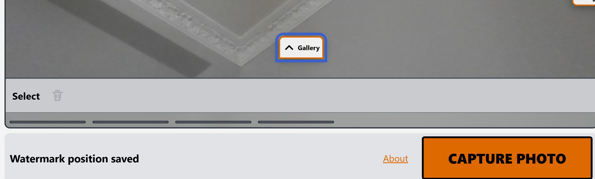

Expected: Galary is supposed to show thumbnail of past photos.

Bug issue: It shows correctly in macos. However in windows, the thumnail area looks like a line instead of rectangle with taken pictures.

The bug is not present in macos: 
This is ui related - i.e frontend/ code

Todo: Investigate the reason, and document here. 

## Investigation

Platform note: this is a Wails app. On macOS the webview is WKWebView (Safari/WebKit engine); on Windows it's WebView2 (Chromium/Edge engine). So "macOS vs Windows" here really means "WebKit vs Chromium" — a plain CSS rendering difference between engines, not a Go/backend issue.

Relevant markup (`frontend/src/components/GalleryPanel.vue`):
```
.gallery-wrap            <- no explicit height, just a CSS Grid item
  .gallery-selection-bar   (position: absolute — out of flow)
  #emptyGallery            (position: absolute — out of flow)
  #gallery                 (height: 100%; display: flex; overflow-x: auto)
    .photo (each card)     (height: 100%)
      .photo-open           (height: 100%)
        .thumb                (height: 100%)
          img                   (height: 100%; object-fit: cover)
```

Relevant CSS (`frontend/src/style.css`):
- `.camera-panel { display: grid; grid-template-rows: minmax(0, 1fr) var(--gallery-height); }` (base rule, and re-declared for the overlay-drawer layout at ~line 975) — `.gallery-wrap` is the 2nd grid row, sized to a fixed `var(--gallery-height)` (e.g. 160px).
- `.gallery-wrap { ... }` (line 196 and again at line 1002) — **never sets `height` anywhere**. It only gets its box size because it's a grid item and grid items default to `align-self: stretch`, which stretches the box to fill the 160px row track.
- `#gallery { height: 100%; ... }` — a real child depending on `.gallery-wrap`'s height being resolvable as a percentage base.
- `.photo`, `.photo-open`, `.thumb`, `img` — each depends on `height: 100%` of its parent, all the way down to the ``.

Root cause: `.gallery-wrap`'s height comes purely from **implicit grid-item stretch alignment**, not from an explicit `height` declaration. Per the CSS sizing spec, a stretched grid item's used height is fine for painting the box itself (which is why the gray gallery band in the Windows screenshot still shows at full height with correct background/border) — but whether that stretched height counts as a *definite height* for **descendants** resolving `height: 100%` is exactly the kind of edge case where WebKit and Chromium have historically disagreed (Chromium has had long-standing bugs where a grid item's auto/stretched height is not treated as definite for percentage resolution of its children).

That matches the screenshots precisely:
- `.gallery-wrap` itself renders at the correct height on both platforms (grid stretch applied to the box is unambiguous).
- On macOS/WebKit, `#gallery`'s `height: 100%` resolves against that stretched height, so `.photo` → `.thumb` → `img` all resolve `height: 100%` down the chain and thumbnails render as full-size rectangles.
- On Windows/Chromium, `#gallery`'s `height: 100%` fails to resolve against `.gallery-wrap`'s implicit height, so `#gallery` collapses to its content's intrinsic height. That collapse cascades to `.photo`/`.thumb`/`img`, which end up rendered at near-zero height — the thin horizontal lines seen in the bug screenshot (just the card border/background peeking through).

This same structure is used in both the desktop and the mobile/portrait media-query layout (~line 1088+), so the bug is not limited to one breakpoint.

## Plan to fix

Give `.gallery-wrap` an **explicit** `height: 100%` (in addition to being a grid item), so its height is unambiguously definite for descendant percentage resolution on every engine, instead of relying on implicit stretch alignment:

- `frontend/src/style.css`, `.gallery-wrap` rule (line ~196): add `height: 100%;`.
- No other files need to change — `#gallery`, `.photo`, `.thumb`, and `img` already declare `height: 100%` explicitly, so once `.gallery-wrap` itself has a definite height, the rest of the chain should resolve correctly on both WebKit and Chromium.
- Verify the fix doesn't affect the `main.gallery-closed .gallery-wrap` collapse animation (it sets `transform`/`opacity`/`padding: 0`, not `height`, so it should be unaffected).

This is a minimal, low-risk one-line CSS change. Since I can't run/screenshot the Windows build from here, verification will need to happen on an actual Windows build (or via a Chromium-based browser dev build with the same HTML/CSS) after the fix lands.

Once I read through and understand I will approve, later you can fix.

## Status: Fixed, round 1 — did NOT resolve it

Applied: added `height: 100%;` to the `.gallery-wrap` rule. Tested on real Windows hardware after `clean.ps1` + `build.ps1` (full clean rebuild, so it wasn't a stale-build issue) — bug still present.

## Round 2 investigation

The round-1 fix was necessary but not sufficient: `.gallery-wrap`'s new `height: 100%` still needs its own containing block — `.camera-panel` — to have a *definite* height for that percentage to resolve. Checked `.camera-panel` (`frontend/src/style.css:105-115`, and re-declared for the overlay-drawer layout at ~line 976) and found the **exact same pattern one level up the tree**: `.camera-panel` is also a CSS Grid item (of `main`'s grid) and also never declares its own `height` — it only gets sized via implicit `align-self: stretch`. So the same WebKit/Chromium discrepancy that broke `.gallery-wrap → #gallery` also breaks `.camera-panel → .gallery-wrap`, one level higher, and my round-1 fix had no definite base to resolve against on Chromium/WebView2.

Full chain, now annotated with what was implicit vs. explicit before round 2:
```
main                      height: 100vh                (explicit, always definite — fine)
  .camera-panel            NO explicit height — implicit grid stretch only  <- round 2 fix
    .gallery-wrap            height: 100% (added round 1) — needed .camera-panel to be definite
      #gallery                 height: 100%              (explicit — fine)
        .photo                  height: 100%              (explicit — fine)
          .photo-open             height: 100%              (explicit — fine)
            .thumb                  height: 100%              (explicit — fine)
              img                     height: 100%              (explicit — fine)
```

## Plan to fix, round 2

Add `height: 100%;` to `.camera-panel`'s base rule (`frontend/src/style.css:105`), matching the round-1 fix for `.gallery-wrap`, so every link in the chain has an explicit (not merely alignment-stretched) height and the percentage chain has no ambiguous link left for Chromium/WebView2 to disagree with WebKit on.

## Status: Fixed, round 2 — did NOT resolve it either

Tested on real Windows hardware after a full `clean.ps1` + `build.ps1`. Bug still present. User noted the bug was **not present before the Vue.js migration**, which is a much stronger clue than anything I'd found by reading CSS.

## Round 3: used the "not before Vue" clue to check what actually changed

Diffed `frontend/src/style.css` against the pre-Vue commit (`d9de302`, the last commit before Vue was introduced in `40ea251`): it is **byte-for-byte identical** except my two `height: 100%` additions and one unrelated icon-path change. So the CSS/grid/flex layout chain itself cannot be the root cause — the exact same layout code rendered correctly on Windows before Vue.

This ruled out CSS as the cause outright, so I stopped trusting static reading of the stylesheet and switched to actually reproducing the bug. Key insight: Wails uses WebView2 (Chromium/Blink engine) on Windows — and desktop Google Chrome on this Mac is *also* Blink. That means Blink-specific layout bugs are reproducible locally without needing the Windows tablet, by testing in real Chrome instead of theorizing about engine differences.

Built and empirically tested (via headless/scripted Chrome, screenshots + `getComputedStyle`, in `/private/tmp/.../scratchpad/repro/`):
1. **Old DOM-construction pattern** (img `src` set before insertion, matching the pre-Vue `gallery.js`) vs **new pattern** (img inserted empty, `src` set later via Vue reactivity) — both render identically, full-height thumbnails.
2. **The actual compiled Vue app** (real `dist/` build, with a stubbed `window.go.main.App` backend standing in for the Go/Wails bridge) — renders correctly.
3. **The real `useLayout.ts` 3-second idle auto-collapse**, then a scripted click on the actual `#galleryDrawerToggle` button to reopen it (matching real user behavior) — renders correctly, confirmed via `getComputedStyle`.
4. **Thumbnails still loading (artificially delayed 4-7s) while the panel is auto-collapsed**, all arriving while hidden, then reopened — still renders correctly, full-height cards.

All four scenarios pass in Blink. Combined with the unchanged CSS, this rules out the grid/flex layout chain, Vue's async image-mount timing, and the drawer collapse/reopen cycle as the root cause.

## Round 4: WebView2 caching theory — also ruled out

Checked Wails' production asset server: it sets no cache-control headers on embedded assets, and WebView2's default user-data/cache folder (`%APPDATA%\PhotoWithOverlay.exe`, since no `Windows.WebviewUserDataPath` is set in `main.go`) lives outside the project entirely — `clean.ps1` only deletes `build\bin`, never that folder. Hypothesized the Windows machine might be running a stale cached build regardless of rebuilds. **User checked: that folder doesn't exist / this isn't it.** Ruled out.

## Where this leaves us

Every software-level, engine-generic scenario I can construct reproduces correctly in Blink (Chrome). Since WebView2 on Windows and Chrome on macOS are both Blink, and I still can't reproduce the squash, the remaining candidates are specific to the physical Windows device rather than the app's code:
- GPU/driver-specific compositing bugs (rugged tablets often have older/minimal integrated GPUs; `backdrop-filter`, `transform`, `opacity` on `.gallery-wrap`/the drawer transitions are all compositor-driven and GPU-dependent).
- An outdated WebView2 Runtime on that specific machine (Evergreen normally auto-updates, but locked-down field tablets often have updates disabled).
- Non-100% Windows display scaling (very plausible on a small-screen rugged tablet), which has a real history of WebView2-specific rounding/rendering bugs not present in desktop Chrome.

## Next diagnostic step (no rebuild needed)

Asked the user to check two things directly on the Windows tablet:
1. Windows display scale factor (Settings > Display > Scale) — try switching to 100% temporarily and see if the thumbnails render correctly.
2. WebView2 Runtime version (installed via Settings > Apps, "Microsoft Edge WebView2 Runtime", or `edge://version` in an Edge window) — to check if it's badly out of date.
3. Run `wails dev` instead of `build.ps1` on that machine — this always enables DevTools (even though the release build has them off) and would give real console errors / computed styles from the actual failing device, which is the strongest signal we're missing.